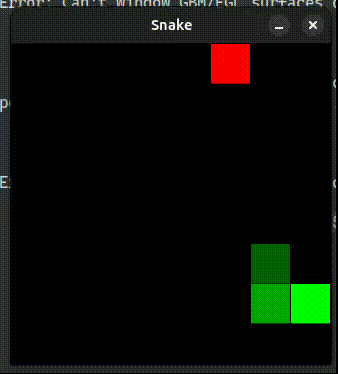

# 基于libtorch使用纯C++下的PPO算法训练贪吃蛇游戏
目前只在Linux系统（Ubuntu24.04）上测试，其他系统也可进行尝试，没有Linux专属的库要求。
## 目录
- [效果图](#效果图)
- [使用方法](#使用方法)
    - [依赖包](#依赖包)
    - [VSCode配置](#vscode配置)
    - [CMake直接编译](#cmake直接编译)
    - [训练及日志](#训练及日志)
- [代码结构](#代码结构)
- [更新日志](#更新日志)
- [调参](#调参)
## 效果图
> 待训练16x16的环境

|环境大小|得分|训练时长/步数|效果图|可视化代码|
|-|-|-|-|-|
|8x8|64|4h/1e9||`./build/eval_ppo --path-ckpt-dir /path/to/ppo_libtorch_snake_game/best_ckpt/v3-retry_seed1_size8_1e9 --find-new-ckpt 0 --game-size 8 --deterministic 1`||
## 使用方法
### 依赖包
#### 需手动安装
1. [GitHub - summary_writer](https://github.com/wty-yy/summary_writer): 用于绘制TensorBoard曲线（在[GitHub - tensorboard_logger](https://github.com/RustingSword/tensorboard_logger)上进行简单重构，以支持LibTorch）
2. SDL2可视化: `sudo apt install libsdl2-dev`
3. LibTorch: 安装参考[PyTorch - Installing C++ Distributions of PyTorch](https://pytorch.org/cppdocs/installing.html)，注意千万，如果你在Python中安装了PyTorch，也不要用其中自带的libtorch库，这个版本是C++11之前的，不支持C++11后的特性，需要从官网上下载带有`cxx11 ABI`相关的库（在下载选项中可以进行选择）。
#### 无需安装
直接以头文件形式编译：
1. [GitHub - argparse](https://github.com/p-ranav/argparse): C++解析命令行中执行程序后跟随的参数

### VSCode配置
`.vscode/settings.json`中加入
```
"cmake.configureArgs": [
  "-DCMAKE_PREFIX_PATH=/path/to/libtorch",  // example: /home/yy/lib/libtorch-2.5.1+cu121
  "-DCMAKE_CUDA_COMPILER=/path/to/nvcc",  // example: /usr/local/cuda/bin/nvcc
  "-DCAFFE2_USE_CUDNN=True"
]
```
(可选)`ctrl+shift+p`找到`C/C++: Edit Configurations (UI)`中包含路径，其中加入
```
/path/to/libtorch/include/torch/csrc/api/include
/path/to/libtorch/include
```
点击左侧CMake图标，点击生成右侧的按钮即可生成可执行文件，
- 在启动中选择`train_ppo_*`开始训练
- 通过终端执行`eval_ppo脚本`开始模型验证，例如
    ```bash
    ./build/eval_ppo --path-ckpt-dir /path/to/ppo_libtorch_snake_game/best_ckpt/v3-retry_seed1_size8_1e9 --find-new-ckpt 0 --game-size 8 --deterministic 1
    ```

### CMake直接编译
```bash
cmake -S . -B build \
  -DCMAKE_PREFIX_PATH=/path/to/libtorch \
  -DCMAKE_CUDA_COMPILER=/path/to/nvcc \
  -DCAFFE2_USE_CUDNN=True
cmake --build build
# 将会编译出如下三个可执行文件
./build/train_ppo -h # MLP
./build/train_ppo_cnn -h # CNN
./build/eval_ppo -h  # Eval
```

### 训练及日志

|网络|执行程序|
|-|-|
|MLP|./build/train_ppo|
|CNN|./build/train_ppo_cnn|

1. 执行训练程序，以`train_ppo`训练大小`8x8`为例: `./build/train_ppo --game-size 8 --total-steps 2e8 --seed 1`（训练1h左右，达到40分左右的成绩）
2. 自动创建`ckpt`和`tb_logs`文件夹，分别存储当前模型参数与tensorboard日志
3. 查看日志信息`tensorboard --logdir ./tb_logs`

## 代码结构
```bash
.
├── CMakeLists.txt  # CMakeLists文件，联合编译，输出多个可执行文件
├── env
│   ├── env.h  # 基类环境
│   ├── env_snake.h  # 贪吃蛇环境SDL2
│   ├── env_snake_sfml.h  # 贪吃蛇环境SFML (弃用, 无法和libtorch同时运行)
│   ├── vec_env.h  # 多进程环境实现 (线程锁与阻塞)
│   └── vec_env_v1.h  # 多进程环境实现 (每次创建新线程, 比单进程还慢, 弃用)
├── include
│   ├── argparse
│   │   └── argparse.hpp  # 用于解析命令行参数
│   └── model
│       ├── cnn.h  # CNN模型
│       └── mlp.h  # MLP模型
├── tests  # 测试代码
│   └── test_cnn.cpp
├── eval_ppo.cpp  # 评估PPO模型, 可视化效果
├── eval_script.sh  # 评估脚本
├── train_ppo_cnn.cpp  # 训练PPO-CNN
├── train_ppo.cpp  # 训练PPO-MLP
├── test_env.cpp  # 测试环境, 手动交互游玩, 或速度测试
└── train_script.sh  # 训练脚本
```

## VecEnv速度提升
使用线程锁和阻塞的方式实现的环境并行，效率极高，在AMD Ryzen 9 7940H下测速如下(测速代码[text_env.cpp](./test_env.cpp)):
```cpp
process: 1 time used: 3.097000s
process: 2 time used: 1.626000s
process: 4 time used: 0.908000s
process: 8 time used: 0.562000s
process: 16 time used: 0.404000s
process: 32 time used: 0.330000s
process: 64 time used: 0.315000s  // x9.8 speed up
process: 128 time used: 0.332000s
process: 256 time used: 0.337000s
process: 512 time used: 0.363000s
process: 1024 time used: 0.479000s
process: 2048 time used: 0.634000s
process: 4096 time used: 0.811000s
time used: 10.205000s
```

## 更新日志
### 2024.11.11.
完成环境制作`env.h, env_snake.h`: 支持渲染, 键盘游玩选项
### 2024.11.12.
支持多进程环境`VecEnv`: 当某一个环境done时, 自动reset, 返回的obs替换成reset后的obs

没有考虑到step到达的终止状态中，蛇头可能越界，从而导致获取obs数组时越界(只有多线程中才发现此问题)，修改为如果done则返回obs全零，因为也会被reset的覆盖掉。

发现写出来的`VecEnv`速度比单线程速度还满，主要原因是每次创建一个新的进程，创建进程效率过低，因此需要为每个环境单独维护一个持续运行的进程
### 2024.11.13.
实现`VecEnv`的难点主要是线程锁和阻塞，使用
1. 区域上锁: 
  ```cpp
  {
    std::lock_guard<std::mutex> lock(cmd_mutex);  // 保护一次命令相关变量的原子性}
    ...  // 上锁代码
  }
  ```
2. 区域上锁后阻塞:
  ```cpp
  std::unique_lock<std::mutex> lock(cmd_mutex);
  cmd_cv.wait(lock, [this](){return cmd != NONE;});  // wait时会自动释放lock锁, 直到被notify_one唤醒, 重新获得lock锁
  ```
3. 修改变量后通知放过阻塞:
  ```cpp
  {
    std::lock_guard<std::mutex> lock(info_mutex);
    info_ready = true;
  }
  info_cv.notify_one();
  ```
实现对`step, reset, 析构函数`的阻塞与信息处理, 每步之间都通过阻塞完成: `submit_action -> run -> get_result`, 第一个和最后一个由主进程调用, 中间run为待机进程, 当收到启动信号(`STEP, RESET, STOP`)开始计算.

## 调参
贪吃蛇为离散奖励任务，尤其是后期场景的决策与开始时差别很大因此需要大量训练，尝试了以下不同的奖励配置：

记重置游戏(撞墙或者吃到自己)的奖励为`reward_done`, 每走一步的奖励为`reward_step`, 每吃到一个食物的奖励为`reward_food`, 默认的`lr=2.5e-4, ent_coef=1e-2` (参考cleanrl_ppo的超参数)
1. v1: `reward_down=-1, reward_step=+1`, 可以训练出吃到51次(5e8 step)食物的模型, 但是非常不稳定（可能是没有动态调整学习率和熵系数）
  - 尝试1: `reward_step=-0.01`训练开始直接崩溃
  - 尝试2: `reward_down=-5 or -10, reward_step=+0.2`训练开始直接崩溃
2. v2: 对学习率和熵系数的动态调整, 删除重置游戏时的奖励: `reward_down=0, reward_step=0.2`, `lr: 2.5e-4 -> 1e-5, ent_coef: 0.01 -> 1e-5`, 比较稳定但是最好只能吃到42个(5e8 step)
3. v3:
  - 对食物奖励动态调整, 约到后期吃到的食物对应的奖励越高, 记当前是第`score`个食物, 则对应的奖励为`max(0.1, score/(width*height))`, 即按照比例进行分配奖励且最少为0.1分
  - 对动态调整的终点略微提高些: `lr: 2.5e-4 -> 5e-5, ent: 0.01 -> 5e-4`
  - 训练效果: 5e8能稳定达到50分以上, 最高52分; 接着训练到1e9, 仍然没有提升
4. v4:
  - 调参: 调整`gamma: 0.95 -> 0.995`, 将最终收敛的学习率进一步降低些 `lr: 2.5e-4 -> 2e-5, ent: 0.01 -> 1e-5`
  - 训练效果: 训练7.5e8步总算收敛, 达到最优策略, 得到64分
5. v5:
  - 调整总训练步数: `total_steps: 8e8, anneal_steps: 7e8`